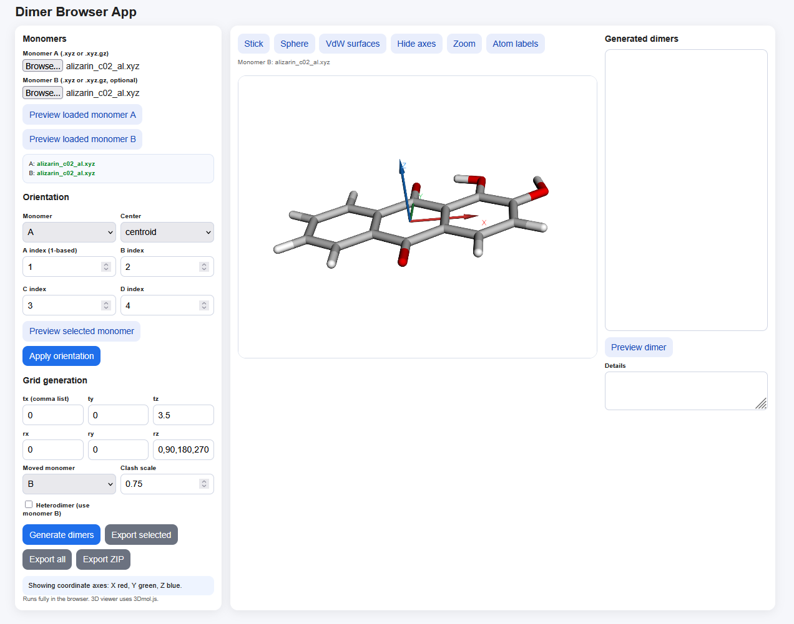
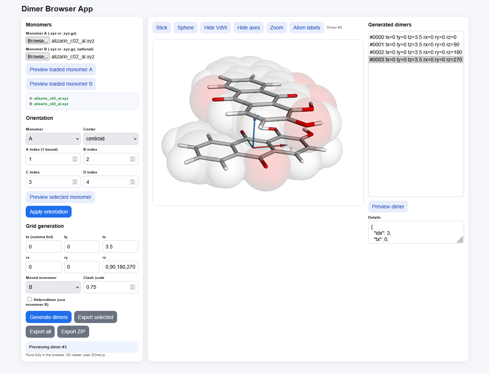

# Dimer Browser

Dimer Browser is a browser-based workbench for systematically constructing, inspecting, and exporting molecular dimer geometries. It accepts XYZ structures, establishes a reproducible coordinate frame, and samples user-defined translations and rotations while rejecting geometries with excessive intermonomer overlap.

There are two main visual checks in the workflow: first establish the monomer coordinate frame, then inspect the generated dimer and its intermolecular contact.

## Scientific philosophy

Dimer Browser inherits the **systematic-search philosophy** of Elmanova, Jahn, and Presselt, [“Catching the π-Stacks: Prediction of Aggregate Structures of Porphyrin”](https://doi.org/10.1021/acs.jpca.4c05969), *The Journal of Physical Chemistry A* **128** (2024), 9917–9926.

In particular, the app is motivated by the idea that aggregate structures should be explored reproducibly across explicit translational and rotational grids rather than selected only by intuition. The paper combines systematic dimer sampling with quantum-chemical energy evaluation, minimum detection, structural clustering, and optimization. This repository currently implements the **geometry-generation and inspection layer only**; it does not perform DFT calculations, rank structures by energy, identify minima, cluster structures, or reproduce the complete published workflow.

This acknowledgment describes methodological inspiration and does not imply affiliation with or endorsement by the paper’s authors, their institutions, or the American Chemical Society.

## Before you begin

Open `index.html` in a current desktop browser. No installation, account, or server is required, and molecular files remain in the browser. Internet access is needed for the 3D viewer and ZIP export because 3Dmol.js and JSZip are loaded from public content-delivery networks.

For more consistent browser behavior, serve the repository locally:

```bash
python -m http.server 8000
```

Then open `http://localhost:8000`. The application accepts ordinary `.xyz` files and gzip-compressed `.xyz.gz` files. Compressed input requires a browser that supports `DecompressionStream`; if it is unsupported, unpack the file before loading it.

An XYZ file must contain the atom count on its first line, a comment on its second line, and one element symbol plus three Cartesian coordinates on each subsequent atom line:

```text
3
water
O  0.000000  0.000000  0.000000
H  0.758602  0.000000  0.504284
H -0.758602  0.000000  0.504284
```

Coordinates and translations are interpreted in ångströms, and rotations are entered in degrees.

## Complete workflow

### 1. Load the monomer structures

Use **Monomer A** to select the first XYZ structure. The file is read as soon as it is selected, and its filename appears in the loaded-files box. Monomer A is always required.

For a homodimer, leave **Monomer B** empty; the application uses a second copy of monomer A. For a heterodimer, load the second structure under **Monomer B** and select **Heterodimer (use monomer B)**. If monomer B has been loaded, it is used as the second monomer even when that checkbox is clear, so leave B unloaded when a strict A–A homodimer is intended.

Use **Preview loaded monomer A** or **Preview loaded monomer B** to inspect the coordinates currently held by the application. The status box at the bottom of the left panel reports successful loads and explains malformed XYZ files or other errors.

### 2. Establish a coordinate frame

Orienting both monomers consistently makes the translation and rotation grid scientifically interpretable. In the **Orientation** section, first choose monomer A or B. Enter four atom numbers in **A index**, **B index**, **C index**, and **D index**. These numbers are 1-based: the first atom line in the XYZ file is atom 1.

The four atoms define an xy molecular plane and a z stacking direction as follows:

- The vector from atom A to atom B becomes the positive x direction.
- The vector from atom C to atom D provides the initial positive y direction.
- The C→D vector is made perpendicular to the x axis, and z is calculated from the right-handed cross product **x × y**. For two in-plane reference vectors, the resulting z axis is therefore normal to the molecular plane and is the π-stacking direction.

The A→B and C→D vectors must be nonzero and must not be parallel. Choose chemically meaningful atoms that define two stable, in-plane molecular directions—for example, one in-plane axis for A→B and a second, nonparallel in-plane axis for C→D. The order of each atom pair controls the positive direction of its axis and, consequently, the sign of the stacking-normal z axis.



*Monomer-orientation check. The RGB triad shows x in red, y in green, and the π-stacking normal z in blue. Confirm that the molecular plane lies approximately in xy before defining the grid.*

Choose the origin with **Center**:

- **centroid** subtracts the arithmetic mean of all atomic coordinates.
- **atom A** places the selected A atom at the origin.
- **ABCD centroid** places the arithmetic mean of the four selected atoms at the origin.
- **none** preserves the existing origin before applying the rotation.

Select **Preview selected monomer** to inspect its current state, then select **Apply orientation** to replace that monomer’s in-memory coordinates with the centered and oriented coordinates. Repeat the operation for monomer B when constructing a heterodimer. Orientation is cumulative: selecting **Apply orientation** again acts on the already transformed coordinates. Reload the original file if you need to reset it.

### 3. Define the translational and rotational grid

The six fields under **Grid generation** accept one number or a list separated by commas, spaces, or semicolons:

- **tx**, **ty**, and **tz** are translations along x, y, and z in ångströms.
- **rx**, **ry**, and **rz** are rotations about x, y, and z in degrees.

For example, `-2,-1,0,1,2` samples five translations, while `0,90,180,270` samples four angles. A blank field is treated as `0`. Range expressions such as `0:0.5:5` are not supported; values must be written explicitly.

Every value is combined with every value in the other fields. Before clash filtering, the number of candidates is therefore:

```text
N(tx) × N(ty) × N(tz) × N(rx) × N(ry) × N(rz)
```

Keep early trial grids small. Grid size grows multiplicatively, and clash detection compares every atom of one monomer with every atom of the other for every candidate.

Use **Moved monomer** to specify which monomer receives the transformation. The other monomer remains fixed. For each candidate, the selected monomer is rotated about the current coordinate origin in x-then-y-then-z order and is subsequently translated by `(tx, ty, tz)`. This is why centering and orienting the monomers before grid generation is important.

The default settings—`tz = 3.5` and `rz = 0,90,180,270`, with all other values zero—place the moved monomer 3.5 Å along the π-stacking normal and sample four in-plane orientations around that axis.

### 4. Choose the clash threshold

**Clash scale** removes candidates in which any intermonomer atom pair is too close. A candidate is rejected when

```text
distance < clash scale × (van der Waals radius of atom 1 + van der Waals radius of atom 2)
```

The default value is `0.75`. Increasing it rejects more structures and enforces greater separation; decreasing it permits closer contacts. The value must be positive. This is a geometric screening rule, not an energy calculation, so a structure that passes the filter is not necessarily stable or physically meaningful.

### 5. Generate and inspect dimers

Select **Generate dimers**. The previous result list is replaced, all Cartesian products of the entered grid values are evaluated, and clashing candidates are omitted. The status box reports the number of valid dimers retained.

Each entry in **Generated dimers** displays its zero-based structure index and the translation and rotation values that produced it. Select an entry and then select **Preview dimer**. Its combined coordinates appear in the central viewer, while **Details** shows the complete JSON metadata, including the moved monomer and the atom counts of A and B.



*Generated-dimer check. The translucent full-size VdW spheres reveal whether the atomic envelopes are separated, touching, or overlapping, while the RGB axes confirm the stacking direction.*

The viewer controls are:

- **Stick** displays bonds and atoms in stick representation.
- **Sphere** displays a compact sphere representation at 35% of the element radii.
- **VdW surfaces** overlays translucent, full-size van der Waals spheres. Two spheres that just meet represent van der Waals contact; visible overlap indicates a separation shorter than the sum of the two radii. Select **Hide VdW** to remove the overlay. This is independent of the geometric clash filter: the display uses full radii, while generated candidates are filtered using the selected clash scale.
- **RGB axes** shows an origin-centered coordinate triad: x is red, y is green, and z is blue. The arrows follow the coordinate system used by the translation and rotation grid. Select **Hide axes** to remove it.
- **Zoom** fits the current structure into the viewer.
- **Atom labels** toggles element symbols and 1-based atom numbers.

If the viewer remains empty, check the status box and confirm that the browser can reach the 3Dmol.js content-delivery network. Geometry generation itself can still run without the viewer.

### 6. Export the results

After selecting a generated structure, use **Export selected** to download one XYZ file. **Export all** initiates a separate browser download for every retained structure; browsers may ask permission for multiple downloads. **Export ZIP** is usually more convenient for a large set because it places all XYZ files in a `dimers` folder within one timestamped archive.

Filenames record the zero-based index, translation, rotation, and moved monomer, for example:

```text
idx0000_tx0_ty0_tz3.5_rx0_ry0_rz90_B.xyz
```

The second line of every exported XYZ file contains the same generation metadata as JSON. The coordinates are written with eight digits after the decimal point. Exports preserve the complete monomer A block followed by the complete monomer B block.

## Practical recommendations

- Confirm atom numbering with **Atom labels** before applying an orientation.
- Orient both partners consistently before a heterodimer search.
- Start with a coarse grid, inspect the retained structures, and then construct a finer grid around promising regions.
- Use a separation axis appropriate to the aggregate motif. For approximately planar π systems oriented in the xy plane, z is often the natural stacking direction.
- After applying orientation, enable **RGB axes** and verify that the molecular plane lies approximately in xy and the blue z arrow is normal to it before generating a stacking grid.
- Record the input files, orientation atoms, center mode, grid lists, clash scale, and app version for reproducibility.
- Use ZIP export for large grids to avoid browser multiple-download restrictions.
- Treat all generated structures as candidates requiring subsequent energy evaluation and geometry refinement.

## Troubleshooting

**“Expected N atom lines, but found M.”** Check the atom count on the first line and ensure every atom line contains an element symbol followed by three valid numbers.

**“Atom index out of range.”** One or more orientation indices are larger than the number of atoms or smaller than 1.

**“Zero-length vector” or “Second axis parallel to first.”** Choose distinct atoms so A→B is nonzero and C→D supplies a direction that is not parallel to A→B.

**No dimers were generated.** The grid may place the monomers too close. Increase the separation values—commonly `tz` after orienting planar monomers—or reduce the clash scale cautiously.

**Too many candidates or slow generation.** Reduce the number of entries in one or more grid fields. The six list lengths multiply.

**A `.xyz.gz` file cannot be read.** Uncompress it to `.xyz`, or use a current browser with `DecompressionStream` support.

**ZIP export is unavailable.** Confirm internet access and reload the page so JSZip can load. Individual XYZ export does not depend on JSZip.

## Scientific-use note

Generated geometries are candidates, not predicted stable structures. Use an appropriate electronic-structure or molecular-mechanics workflow to evaluate energies, locate minima, group redundant geometries, and refine structures before drawing scientific conclusions.

## Update note: z-axis stacking convention

Version 1.1.0 changes the orientation convention used by earlier versions. Previously, A→B defined x and C→D defined z, which placed a molecule described by two in-plane reference vectors in the xz plane and made y the plane normal. The application now maps A→B to x and C→D to y; the right-handed normal **x × y** becomes z. As a result, `tz` now directly controls stacking separation and `rz` controls rotation around the stacking axis after orientation.

Existing input XYZ files remain compatible, but grids prepared with the earlier axis convention should be reviewed before reuse. Reapply orientation with the intended in-plane A→B and C→D atom pairs, verify the RGB axes, and translate old y-stacking grids to the corresponding z-axis fields where necessary.

## GitHub Pages

In the repository settings, choose **Pages → Deploy from a branch**, select the default branch and `/ (root)`. The repository is already arranged for root-level static hosting.

## Citation

If this application contributes to scientific work, cite the repository release under the software authors **Anna Elmanova, Arghyadeb Roy, and Martin Presselt**, and acknowledge the methodological paper:

> A. Elmanova, B. O. Jahn, M. Presselt, “Catching the π-Stacks: Prediction of Aggregate Structures of Porphyrin,” *J. Phys. Chem. A* **2024**, *128*, 9917–9926. https://doi.org/10.1021/acs.jpca.4c05969

## License

Released under the [MIT License](LICENSE).
